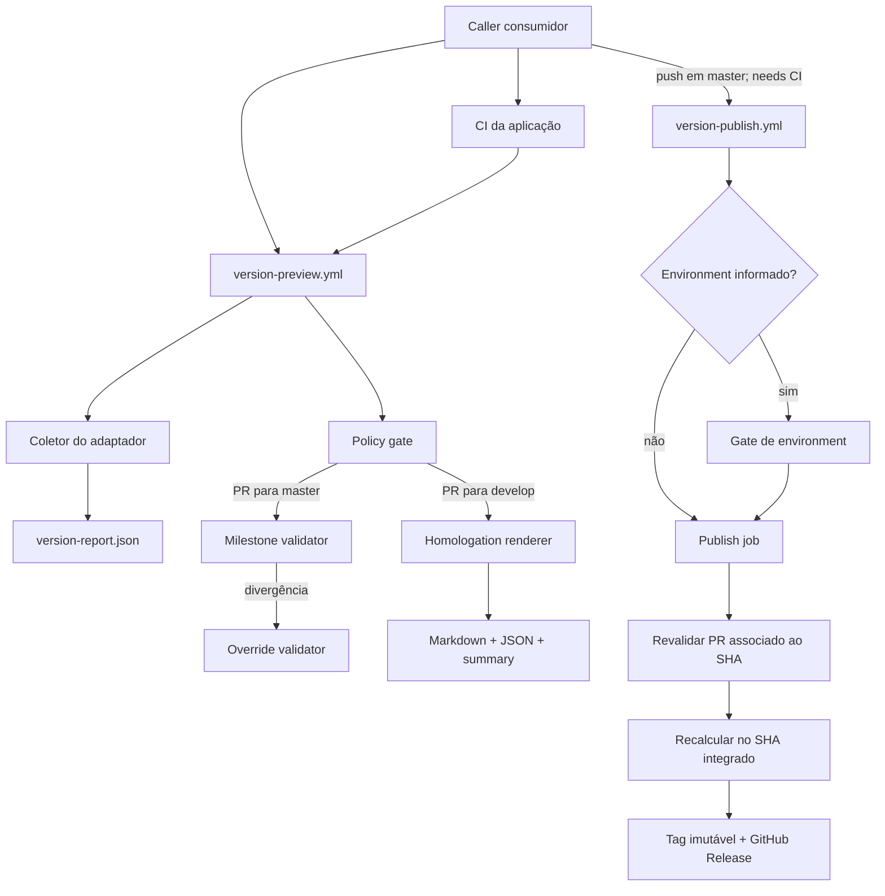

# Pipeline Centralizada de Versionamento Design

**Spec**: `.specs/features/centralized-versioning-pipeline/spec.md`
**Status**: Approved

---

## Architecture Overview

A implementação evolui os workflows e scripts existentes. Um coletor calcula a versão com o adaptador nativo e grava um envelope JSON normalizado. Validadores puros consomem esse envelope e snapshots da API do GitHub. Scripts orquestradores ficam responsáveis somente por checkout, chamadas autenticadas e efeitos externos.



### Abordagens consideradas

| Abordagem | Vantagem | Custo | Decisão |
| --------- | -------- | ----- | ------- |
| Envelope normalizado e validadores separados | Reaproveita os scripts atuais, separa cálculo, política e efeitos, permite testes determinísticos | Adiciona pequenos módulos e arquivos intermediários | **Adotada** |
| Expandir os scripts shell monolíticos | Menos arquivos no primeiro momento | Mistura parsing, autorização, GitHub API e publicação; fixtures ficam frágeis | Rejeitada |
| Migrar tudo para uma composite action | Interface reutilizável própria | Adiciona outra camada e não elimina a necessidade dos workflows reutilizáveis | Adiada |

---

## Code Reuse Analysis

### Existing Components to Leverage

| Component | Location | How to Use |
| --------- | -------- | ---------- |
| Seleção segura de adaptadores | `scripts/versioning/resolve-adapter.sh` | Manter enumeração fechada, confinamento do caminho e descoberta do binário. |
| SemVer e comparação | `scripts/versioning/version.mjs` | Reutilizar parsing estável e `compare`; acrescentar seleção da maior tag alcançável e bootstrap. |
| Cálculo Go nativo | `scripts/versioning/prepare-release.sh` | Extrair a chamada JSON/`--explain` para o coletor comum e manter validação de SHA. |
| Orquestração de PR | `scripts/versioning/preview.sh` | Substituir dependência de épica pelo contrato de milestone do PR final e chamar os novos validadores. |
| Gates pós-merge | `scripts/versioning/release-gates.sh` | Reutilizar validação de evento, branch, SHA remoto e associação commit/PR. |
| Publicação idempotente | `scripts/versioning/publish.sh` | Preservar reconciliação de tag/release, ausência de force-push e retry após corrida. |
| Fixture Go real | `tests/versioning/real-go-gitsemver.mjs` | Expandir bootstrap e validar o envelope e o relatório nativo. |
| Fixtures de API | `tests/versioning/pr-check.mjs`, `tests/versioning/post-merge.mjs` | Evoluir os mocks de `gh` para timeline, permissões, reviews e milestone do PR. |
| Guia atual | `scripts/versioning/homologation-guide.sh` | Substituir a lista de commits por renderer Markdown/JSON baseado no envelope. |

### Integration Points

| System | Integration Method |
| ------ | ------------------ |
| Repositório consumidor | Caller com jobs `ci`, `preview` e `publish`; lógica de política permanece central. |
| GitHub pull requests | Payload do evento para prévia; REST API para snapshot atual, timeline, reviews e associação com SHA. |
| GitHub permissions | Endpoint de permissões do colaborador; `role_name` precisa ser `maintain` ou `admin`. |
| GitHub Actions | Artifacts, job summary, concurrency e gate condicional de environment. |
| Git tags e Releases | REST API e Git remoto, sempre vinculados ao SHA integrado e reconciliados em retry. |
| `go-gitsemver` | Binário instalado em revisão fixa e executado com JSON, SHA explícito e `--explain`. |

---

## Components

### Adapter report collector

- **Purpose**: Executar o adaptador selecionado uma vez e persistir resultado nativo e projeção normalizada.
- **Location**: `scripts/versioning/collect-version-report.sh`, `scripts/versioning/version-report.mjs`
- **Interfaces**:
  - `collect-version-report.sh <output.json>` - grava o envelope para o SHA e branch configurados.
  - `version-report.mjs normalize-go <native-json> <explanation-file> ...` - valida e normaliza Go.
  - `version-report.mjs validate <report.json>` - valida schema e invariantes.
- **Dependencies**: `resolve-adapter.sh`, `version.mjs`, Git e binário do adaptador.
- **Reuses**: Chamada Go e validação de SHA hoje presentes em `prepare-release.sh`.

### Release policy evaluator

- **Purpose**: Avaliar milestone, diferença planejada e autorização de override sem efeitos externos.
- **Location**: `scripts/versioning/release-policy.mjs`
- **Interfaces**:
  - `release-policy.mjs evaluate <policy-input.json> <policy-output.json>` - retorna decisão e diagnóstico.
  - Input `phase` defaults to `preview`: report SHA must equal PR `headSha`. Trusted post-merge gates set `publication`: report SHA must equal `mergeCommitSha` of the integrated PR. Override reviews always match PR `headSha`, never the merge SHA.
  - `release-policy.mjs milestone <base> <candidate> <title-or-empty>` - usado por fixtures focadas.
- **Dependencies**: Snapshot coletado pelo orquestrador e utilitários SemVer.
- **Reuses**: `version.mjs compare` e convenções de saída JSON dos testes atuais.

### GitHub policy snapshot collector

- **Purpose**: Coletar o estado atual necessário para uma decisão auditável.
- **Location**: `scripts/versioning/collect-pr-policy.sh`
- **Interfaces**:
  - `collect-pr-policy.sh <pr-number> <output.json>` - coleta PR, milestone, timeline, reviews e permissões relevantes.
  - `collect-pr-policy.sh --commit <sha> <output.json>` - exige uma associação única `develop → master` ou `hotfix/<nome> → master` integrada.
- **Dependencies**: `gh`, `GH_TOKEN`, GitHub REST API.
- **Reuses**: Helpers de API e associação commit/PR de `release-gates.sh`.

O coletor usa a timeline para localizar a aplicação vigente do label. Reviews anteriores ao label são descartados. Para cada identidade candidata, consulta o papel efetivo atual e armazena somente os campos necessários. Qualquer erro ou paginação incompleta falha fechado.

### Homologation renderer

- **Purpose**: Transformar fatos do adaptador, PR e checks em guia humano e documento estruturado.
- **Location**: `scripts/versioning/homologation-guide.mjs`
- **Interfaces**:
  - `homologation-guide.mjs <report.json> <pr-snapshot.json> <output-directory>` - gera os dois artefatos.
- **Dependencies**: Envelope normalizado, metadados do PR e checks conhecidos para o SHA.
- **Reuses**: Resumo já escrito por `homologation-guide.sh` e coleta de commits do Git.

O renderer escreve arquivos diretamente, sem interpolar dados não confiáveis em comandos shell. O JSON separa `facts` de `suggested_checks`. O Markdown escapa conteúdo vindo de commits, PR e explicação antes de escrever no job summary.

### Preview orchestrator

- **Purpose**: Detectar a fase do PR e coordenar cálculo, política e artifacts.
- **Location**: `.github/workflows/version-preview.yml`, `scripts/versioning/preview.sh`
- **Interfaces**:
  - Inputs: `adapter`, `target_branch`, `project_path` e configurações nativas do consumidor.
  - Outputs: `phase`, `version`, `bump`, `policy_outcome`, `summary`.
- **Dependencies**: Collector, policy evaluator e renderer.
- **Reuses**: Checkout duplo fixado na revisão do workflow e outputs atuais.

O workflow é acionado novamente para `opened`, `reopened`, `synchronize`, `edited`, `labeled`, `unlabeled` e reviews. O caller deve encaminhar tanto eventos de pull request quanto de review ao mesmo workflow central.

### Optional environment gate

- **Purpose**: Suspender publicação somente quando o consumidor nomear um environment.
- **Location**: `.github/workflows/version-publish.yml`
- **Interfaces**:
  - Input opcional `publication_environment`, default vazio.
  - Job `environment-gate` executa somente para valor não vazio e referencia o environment.
  - Job `publish` aceita predecessor `success` ou `skipped`; qualquer outro resultado bloqueia.
- **Dependencies**: Regras configuradas no repositório consumidor.
- **Reuses**: Job de publicação atual.

Essa estrutura evita depender do comportamento de `environment.name` vazio. O job de escrita continua único e não duplica passos.

### Publisher

- **Purpose**: Revalidar o estado integrado e criar ou reconciliar tag e GitHub Release.
- **Location**: `scripts/versioning/publish.sh`, `.github/workflows/version-publish.yml`
- **Interfaces**:
  - Inputs: `adapter`, `target_branch`, `project_path`, `publication_environment` e changelog opcional.
  - Outputs: `version`, `tag`, `published_sha`, `release_url`, `outcome`.
- **Dependencies**: Association endpoint, snapshot collector, report collector e GitHub API.
- **Reuses**: Reconciliação e tratamento de corrida atuais.

O publisher não confia em booleano de aprovação fornecido pelo caller. Ele exige evento `push`, branch correta, SHA remoto idêntico, PR integrado associado e policy válida. O caller garante a precedência da CI por `needs`; as regras de branch tornam esse job obrigatório no fluxo adotado.

---

## Data Models

### VersionReport

```typescript
interface VersionReport {
  schemaVersion: 1
  adapter: 'go-gitsemver' | 'standard-version' | 'changesets' | 'jgitver'
  sha: string
  branch: string
  baseVersion: string
  candidateVersion: string
  tag: string
  bump: 'none' | 'patch' | 'minor' | 'major'
  native: {
    format: string
    result: unknown
    explanation: string
  }
}
```

Para o primeiro perfil liberado, `native.result` contém o JSON do `go-gitsemver`. Os outros perfis continuam compatíveis com o contrato existente, mas não recebem implementação completa nesta feature.

### PullRequestPolicySnapshot

```typescript
interface PullRequestPolicySnapshot {
  repository: string
  number: number
  headSha: string
  headBranch: string
  baseBranch: string
  mergedAt: string | null
  mergeCommitSha: string | null
  milestone: { title: string } | null
  override: {
    labelPresent: boolean
    labeledBy: string | null
    labeledAt: string | null
    labelerRole: string | null
    approvalBy: string | null
    approvedAt: string | null
    approverRole: string | null
    reviewedCommitSha: string | null
  }
}
```

### ReleasePolicyDecision

```typescript
interface ReleasePolicyDecision {
  outcome: 'matched' | 'adapter-authoritative' | 'overridden' | 'blocked'
  plannedVersion: string | null
  calculatedVersion: string
  plannedBump: 'none' | 'patch' | 'minor' | 'major' | null
  calculatedBump: 'none' | 'patch' | 'minor' | 'major'
  reasons: string[]
  audit: {
    labeler: string | null
    approver: string | null
    labeledAt: string | null
    approvedAt: string | null
  }
}
```

### HomologationGuide

```typescript
interface HomologationGuide {
  schemaVersion: 1
  facts: {
    repository: string
    pullRequest: number
    sha: string
    candidateVersion: string
    bump: string
    nativeExplanation: string
    changes: string[]
    checks: Array<{ name: string; status: string; conclusion: string | null }>
  }
  suggestedChecks: Array<{ id: string; description: string; status: 'pending' }>
}
```

---

## Workflow Contracts

### `version-preview.yml`

| Input | Required | Default | Purpose |
| ----- | -------- | ------- | ------- |
| `adapter` | yes | - | Seleciona enum conhecido. |
| `target_branch` | yes | - | Branch protegida de publicação. |
| `project_path` | no | `.` | Projeto dentro do checkout. |

| Output | Meaning |
| ------ | ------- |
| `phase` | `release-to-develop`, `develop-to-main` ou `hotfix-to-main` no MVP. |
| `version` | Versão candidata normalizada. |
| `bump` | Incremento calculado. |
| `policy_outcome` | Resultado da milestone e do override. |
| `summary` | Diagnóstico curto, sem conteúdo não confiável não escapado. |

### `version-publish.yml`

| Input | Required | Default | Purpose |
| ----- | -------- | ------- | ------- |
| `adapter` | yes | - | Adaptador calculador. |
| `target_branch` | yes | - | `master` no primeiro caller. |
| `project_path` | no | `.` | Projeto consumidor. |
| `publication_environment` | no | `''` | Gate adicional do consumidor. |
| `changelog_path` | no | `''` | Complemento opcional já integrado. |

O input legado `homologation_environment` será removido do exemplo e documentado na migração. O workflow não aceita flags como `approved`, `force` ou `skip_validation`.

---

## Event and State Rules

1. Um PR para `develop` calcula a versão e gera o guia. A ausência de milestone não interfere.
2. Um PR `develop → master` ou `hotfix/<nome> → master` calcula a versão e avalia a mesma milestone/policy atual.
3. Divergência chama a avaliação do override; correspondência não exige override.
4. Eventos que alteram conteúdo ou política executam novamente o mesmo check obrigatório.
5. Depois do merge, o push em `master` inicia o caller. O job de publicação depende da CI do consumidor.
6. O workflow central encontra o PR integrado pelo SHA, exige origem `develop` ou `hotfix/<nome>` com nome não vazio, recalcula e reavalia a mesma policy. Nenhum gate adicional é dispensado para hotfix.
7. O gate de environment roda antes do job de escrita somente quando configurado.
8. Tag e release são reconciliadas antes de qualquer POST. Estado idêntico conclui como `already-published`; conflito falha.

---

## Error Handling Strategy

| Error Scenario | Handling | User Impact |
| -------------- | -------- | ----------- |
| Saída nativa inválida ou SHA divergente | Encerrar collector; não gerar policy válida | Check vermelho com adaptador, SHA esperado e causa. |
| Milestone inválida | Decision `blocked` | Diagnóstico mostra título e formato esperado. |
| Divergência sem override completo | Decision `blocked` | Diagnóstico mostra planejado, calculado e etapa ausente. |
| Label aplicado por usuário sem papel | Falha fechada | Tentativa fica visível no check; label não concede acesso. |
| Paginação, permissão ou API indisponível | Falha fechada | Reexecução necessária depois de restaurar acesso. |
| PR associado ao SHA ausente ou ambíguo | Recusar publicação | Nenhum efeito externo. |
| Tag existente em outro SHA | Conflito fatal | Sem force-push ou alteração da release. |
| Tag correta e release ausente | Criar somente a release | Recuperação idempotente de falha parcial. |
| Release correta já existente | `already-published` | Reexecução verde e sem duplicação. |
| Upload do artifact falhar | Check falha depois de manter summary já escrito | Guia não é considerado entregue parcialmente. |
| Environment rejeitado ou expirado | Publish não inicia | Estado externo permanece intacto. |

---

## Risks & Concerns

| Concern | Location (file:line) | Impact | Mitigation |
| ------- | -------------------- | ------ | ---------- |
| Guia atual ignora adaptador e só lista commits | `scripts/versioning/homologation-guide.sh:7` | Homologador não recebe versão nem explicação nativa | Substituir por renderer que consome `VersionReport`. |
| Falha do guia é ignorada | `.github/workflows/version-preview.yml:66` | Check pode ficar verde sem artifact exigido | Remover `continue-on-error` e testar falha de geração/upload. |
| Environment é obrigatório | `.github/workflows/version-publish.yml:19` | Consumidor não consegue publicação automática após CI | Introduzir gate condicional separado e input opcional. |
| CI central não chama `tests/versioning` | `.github/workflows/ci.yml:50` | Regressões da pipeline passam sem teste | Criar job explícito com Node, Bash e teste real Go. |
| Actions principais usam tags móveis | `.github/workflows/ci.yml:22` | Supply-chain menos determinística que os workflows reutilizáveis | Fixar SHAs das actions alteradas. |
| Política atual depende de épica e texto de homologação | `scripts/versioning/release-gates.sh:79` | Contraria milestone opcional no PR e cria acoplamento legado | Substituir por snapshot do PR e policy única para preview/publish. |
| Explicação nativa chega por stderr | `tests/versioning/go-version.mjs:20` | Captura ingênua perde o conteúdo ou mistura erro real | Capturar stdout e stderr separados, validar JSON e persistir explicação. |
| Dados de PR e commits são não confiáveis | `scripts/versioning/preview.sh:54` | Markdown ou shell podem interpretar conteúdo inesperado | Nunca avaliar texto como shell; escapar no renderer e escrever via API de arquivos. |
| Retry contém espera fixa | `scripts/versioning/publish.sh:109` | Recuperação limitada sob consistência eventual | Manter tentativas curtas no MVP, testar reconciliação e documentar limite. |

---

## Tech Decisions

| Decision | Choice | Rationale |
| -------- | ------ | --------- |
| Unidade de integração | Envelope JSON versionado | Permite compartilhar o mesmo cálculo entre guia, policy e publicação. |
| Lógica de política | Node puro com entrada JSON | Facilita fixtures determinísticas e elimina parsing complexo em shell. |
| Acesso ao GitHub | Shell orquestra `gh api`; Node decide | Mantém autenticação e paginação próximas à CLI e política testável sem rede. |
| Environment opcional | Job de gate condicional separado | Não depende de nome vazio e evita duplicar o job de publicação. |
| Verificação de papel | `role_name` atual do colaborador | O campo legado `permission` não distingue de forma confiável Write de Maintain. |
| Proveniência pós-merge | PR único associado ao SHA e origem `develop` ou `hotfix/<nome>` | Defende contra push direto mesmo se a proteção estiver configurada incorretamente. |
| Saída de homologação | Markdown + JSON + summary | Atende pessoas e automações sem criar commit. |
| Publicação | Reconcile-before-write | Torna retries seguros e recupera tag criada sem release. |

---

## Requirement Coverage

| Requirement | Components |
| ----------- | ---------- |
| VER-01 | Adapter report collector, `VersionReport` |
| VER-02 | GitHub snapshot collector, release policy evaluator |
| VER-03 | Snapshot collector, release policy evaluator |
| VER-04 | Adapter report collector, homologation renderer, preview orchestrator |
| VER-05 | Optional environment gate, publisher |
| VER-06 | Workflows, fixtures, caller e documentação |
