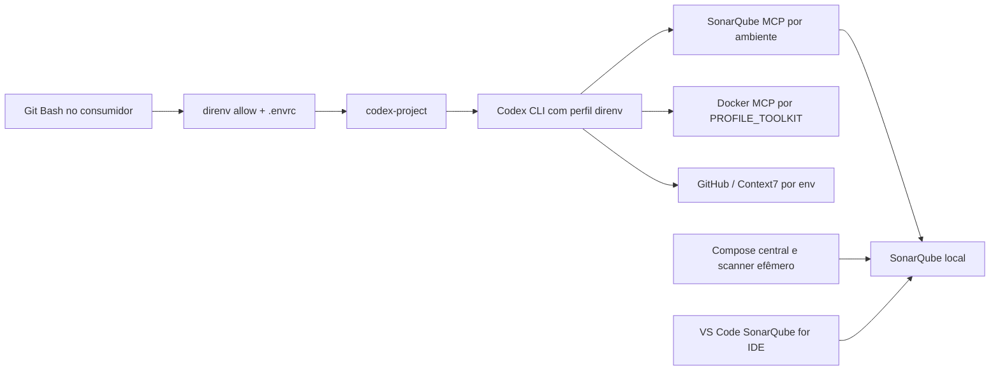

# Codex CLI por projeto com direnv e SonarQube Design

**Spec**: `.specs/features/codex-direnv-sonarqube/spec.md`
**Status**: Draft; decisões de conflito aguardam o usuário.

## Architecture Overview

**Recomendação: perfil aditivo + lançador Bash.** Manter `~/.codex/config.toml` e `opencode.json` intactos. Instalar o Codex CLI autônomo em um caminho estável, copiar um novo perfil `~/.codex/direnv.config.toml` a partir de um exemplo versionado e iniciar `codex-project` no Git Bash após o direnv. O perfil desabilita as entradas globais fixas apenas no CLI e declara novos MCPs que usam variáveis; o lançador ativa cada MCP somente quando seu conjunto de variáveis está completo.

**Corte final pendente:** este primeiro estágio prova o comportamento por sessão, mas não torna o arquivo global inteiramente genérico. O header atual do Context7 em `~/.codex/config.toml` contém um valor literal que coincide com `API_KEY_CONTEXT7`, e as entradas Sonar/Docker ainda citam o k6. Depois do piloto, a escolha recomendada é substituir o header estático por `env_http_headers`, migrar `MCP_DOCKER` para a expansão de `PROFILE_TOOLKIT` e substituir/desativar a entrada `sonarqube-k6-local` em favor da genérica. Isso altera o Codex global; `opencode.json` e `.envrc` existentes permanecem preservados. Se o usuário optar por manter todas as entradas globais antigas, o perfil CLI funciona, mas o arquivo global continua com valores fixos.

Uma nova sessão é necessária quando o terminal muda de projeto: o `direnv` altera o ambiente do shell, mas uma conexão MCP já criada não recebe automaticamente o novo ambiente.

### Alternativas consideradas

| Abordagem | Vantagem | Custo / incompatibilidade |
| --- | --- | --- |
| **Perfil `direnv` + lançador Bash (recomendada)** | Preserva entradas globais e permite seleção condicional por processo. | Exige `codex-project` e configuração inicial do perfil. |
| `.codex/config.toml` em cada consumidor | Usa camadas nativas por projeto. | Replica entradas, depende da confiança do projeto e não resolve sozinho argumentos dinâmicos do Docker Gateway. |
| Substituir entradas globais atuais em `config.toml` | Um único arquivo visível a todos os clientes. | Contraria a exigência de preservar configurações e mantém o problema do ambiente do App Desktop. |

## Evidence and Configuration Contract

- O Codex usa `~/.codex/config.toml` e aceita um perfil de usuário `~/.codex/<nome>.config.toml`; a camada de perfil tem prioridade sobre a configuração global. [Config basics](https://learn.chatgpt.com/docs/config-file/config-basic).
- Um MCP stdio aceita `command`, `args` e `env_vars`; MCP HTTP aceita `bearer_token_env_var` e `env_http_headers`. O TOML não oferece a substituição `{env:VAR}` do OpenCode dentro de `args`; a expansão de `PROFILE_TOOLKIT` deve ocorrer no Bash. [MCP no Codex](https://learn.chatgpt.com/docs/extend/mcp?surface=cli).
- O instalador autônomo Windows usa `%LOCALAPPDATA%\Programs\OpenAI\Codex\bin` por padrão. [Variáveis do instalador](https://learn.chatgpt.com/docs/config-file/environment-variables), [instalador oficial](https://github.com/openai/codex/blob/main/README.md).
- `SONARQUBE_PROJECT_KEY` no MCP fornece a chave padrão aos tools; não é uma fronteira de autorização. Os privilégios vêm do User Token. [SonarQube MCP](https://github.com/SonarSource/sonarqube-mcp-server/blob/master/README.md), [tokens](https://docs.sonarsource.com/sonarqube-server/user-guide/managing-tokens).
- O SonarQube for IDE conectado exige User Token e binding da pasta com o projeto. [Connected Mode](https://docs.sonarsource.com/sonarqube-for-vs-code/connect-your-ide/setup).

| Variável do consumidor | Uso | Fonte no k6 atual |
| --- | --- | --- |
| `SONAR_TOKEN` | Análise completa pelo scanner do Compose | `SQP_K6_RUNNER`, Project Analysis token externo. |
| `SONARQUBE_TOKEN` | SonarQube MCP | `SQU_FOR_ANALYZER_IN_IDE`, User Token externo. |
| `SONARQUBE_URL` | Endereço visto pelo contêiner MCP | `http://host.docker.internal:9000`. |
| `SONARQUBE_PROJECT_KEY` | Projeto padrão do MCP | `K6-Runner`. |
| `SONARQUBE_CLI_TOKEN` / `SONARQUBE_CLI_SERVER` | SonarQube CLI opcional | User Token e `http://localhost:9000`. |
| `PROFILE_TOOLKIT` | Perfil do Docker MCP Gateway | Hoje vem do ambiente Windows como `k6_mcps`; deverá pertencer a cada `.envrc`. |
| `GITHUB_PERSONAL_ACCESS_TOKEN` | Bearer token do GitHub MCP | Variável externa mapeada no `.envrc`. |
| `API_KEY_CONTEXT7` | Header do Context7 MCP | Variável externa; ainda não mapeada no `.envrc` do k6. |

## Code Reuse Analysis

### Existing Components to Leverage

| Component | Location | How to Use |
| --- | --- | --- |
| Compose central | `docker-compose.yml` | Continua hospedando servidor e scanner; nenhuma alteração necessária para os MCPs. |
| Contrato do consumidor | `examples/consumer.envrc.example` | Acrescentar exemplo de `PROFILE_TOOLKIT` e demais variáveis opcionais sem mexer nas atuais. |
| Sonar MCP existente | `scripts/start-sonarqube-mcp.sh`, `.ps1` | Preservar como alternativa para VS Code e App Desktop; o perfil CLI pode usar Docker diretamente com ambiente herdado. |
| Guia local | `README.md` | Acrescentar instalação do Codex CLI, perfil, lançamento, checagens e recuperação. |
| OpenCode | `~/.config/opencode/opencode.json` | Referência de paridade; somente leitura. |

### Integration Points

| System | Integration Method |
| --- | --- |
| Codex CLI | Perfil `direnv` selecionado no lançamento; entradas legadas desabilitadas nessa sessão. |
| SonarQube MCP | `docker run --init --rm -i` com `-e SONARQUBE_TOKEN`, `-e SONARQUBE_URL`, `-e SONARQUBE_PROJECT_KEY`, `-e SONARQUBE_READ_ONLY=true`. |
| Docker MCP Gateway | `bash.exe -c` expande `PROFILE_TOOLKIT` antes de `docker mcp gateway run --profile`. |
| GitHub MCP | `bearer_token_env_var = "GITHUB_PERSONAL_ACCESS_TOKEN"`. |
| Context7 MCP | `env_http_headers = { CONTEXT7_API_KEY = "API_KEY_CONTEXT7" }`. |
| VS Code SonarQube for IDE | Validar conexão `http-localhost-9000`, binding `K6-Runner` e análise de arquivo aberto. |

## Components

### Perfil Codex por ambiente

- **Purpose**: Declarar MCPs genéricos e neutralizar entradas legadas somente no fluxo CLI.
- **Source**: `examples/codex.direnv.config.toml.example`; cópia local em `~/.codex/direnv.config.toml`.
- **Interfaces**: `[mcp_servers.sonarqube-env]`, `[mcp_servers.MCP_DOCKER_ENV]`, `[mcp_servers.github-env]`, `[mcp_servers.context7-env]`; `enabled = false` por padrão, ativados por `-c` no lançamento.
- **Dependencies**: Codex CLI, Docker, Git Bash, variáveis já exportadas.
- **Reuses**: Camadas nativas do Codex e as mesmas variáveis do OpenCode quando compatíveis.

### Lançador Git Bash

- **Purpose**: Verificar o ambiente atual e iniciar o CLI com apenas os MCPs elegíveis.
- **Source**: `scripts/codex-project.sh`; cópia ou link em `~/.tools/codex-project` para uso no PATH.
- **Interfaces**: `codex-project [argumentos do codex]`, `codex-project --check` (mostra só presença de variáveis, projeto e nomes de MCPs selecionados). O script chama `direnv export bash` para carregar o `.envrc` já aprovado no seu próprio processo antes da seleção.
- **Dependencies**: `direnv` carregado, instalação autônoma de `codex`, perfil `direnv`.
- **Reuses**: `codex --profile direnv` e `-c mcp_servers.<id>.enabled=<bool>`.

### Contrato de cada consumidor

- **Purpose**: Mapear tokens externos e identificação local aos nomes genéricos usados pelos clientes.
- **Location**: `.envrc` ignorado em cada consumidor; modelo em `examples/consumer.envrc.example`.
- **Interfaces**: Variáveis da tabela acima.
- **Dependencies**: Variáveis externas existentes no Git Bash; `direnv allow` após mudança no arquivo.
- **Reuses**: Mapeamento já funcional do k6.

## Error Handling Strategy

| Error Scenario | Handling | User Impact |
| --- | --- | --- |
| `SONARQUBE_TOKEN` presente com URL/chave ausente | Encerrar antes de abrir Codex e listar nomes ausentes. | Corrige o `.envrc` sem escolher projeto errado. |
| `PROFILE_TOOLKIT` vazio | Não ativar `MCP_DOCKER_ENV`. | Outros MCPs continuam disponíveis. |
| Token opcional do GitHub/Context7 ausente | Desabilitar somente o respectivo MCP. | Sessão continua com os demais. |
| Docker ou SonarQube indisponível | Mostrar falha de inicialização/consulta, sem fallback para outro projeto. | Diagnóstico local sem troca silenciosa. |
| Binário `codex` resolvido para a pasta versionada do Desktop | `--check` falha com instrução para corrigir a ordem do PATH. | Evita dependência de atualização do Desktop. |

## Risks & Concerns

| Concern | Location (file:line) | Impact | Mitigation |
| --- | --- | --- | --- |
| O stack não é um repositório Git. | Raiz do workspace (`git rev-parse` falha) | A execução TLC não consegue cumprir commits atômicos. | Decidir inicialização Git local antes de Execute. |
| Sonar MCP global aponta fixamente para o k6. | `~/.codex/config.toml:70` | Outra sessão poderia consultar o projeto errado. | Perfil CLI desabilita a entrada legada; manter definição intacta. |
| Docker MCP global usa `k6_mcps`. | `~/.codex/config.toml` em `[mcp_servers.MCP_DOCKER]` | Perfil de ferramentas errado fora do k6. | Perfil CLI desabilita a entrada legada e cria `MCP_DOCKER_ENV`. |
| Context7 global usa `http_headers` estático. | `~/.codex/config.toml` em `[mcp_servers.context7]` | Não acompanha `API_KEY_CONTEXT7` por projeto. | Criar `context7-env` com `env_http_headers` e desabilitar legado só no perfil. |
| O header Context7 global contém um valor literal igual à variável externa atual. | `~/.codex/config.toml` em `[mcp_servers.context7.http_headers]` | O objetivo de não guardar credenciais literais não está completo mesmo com o perfil novo. | Após decisão do usuário, migrar a entrada global para `env_http_headers` e verificar sem imprimir o valor. |
| O executável atual do Codex vem de diretório versionado do Desktop. | PATH do Git Bash | A próxima atualização pode mudar o caminho. | Instalar CLI autônoma e priorizar seu diretório estável. |
| O k6 `.envrc` não declara `PROFILE_TOOLKIT`. | `../k6/.envrc` | Herda o valor global `k6_mcps`; outro projeto poderia herdar o mesmo. | Incluir mapeamento explícito por consumidor na ativação local. |
| O k6 possui mudanças de usuário não relacionadas em andamento. | `../k6` (`git status --short`) | Alterações poderiam ser misturadas em commits TLC. | Não limpar nem incluir essas alterações; qualquer commit no k6 deve ser isolado. |
| Binding VS Code configurado, mas estado visual não confirmado. | `../k6/.vscode/settings.json` | Não há evidência completa do modo conectado. | Checagem no painel Connected Mode e análise de um arquivo aberto. |

## Tech Decisions

| Decision | Choice | Rationale |
| --- | --- | --- |
| Endereço do Sonar no MCP Docker | `host.docker.internal:9000` | O contêiner não alcança o host pelo próprio `localhost`. |
| Escopo do MCP Sonar | `SONARQUBE_PROJECT_KEY` e somente leitura | Foco no consumidor atual; a autorização continua definida pelo User Token. |
| SonarQube CLI | Manter opcional | O scanner do Compose já publica a análise completa; a CLI agrega consultas locais. |
| GitKraken e ApexCharts | Inventariar, não substituir no primeiro corte | O OpenCode tem essas entradas, mas não são necessárias para fechar o SonarQube; a [CLI do GitKraken suporta Codex](https://gitkraken.github.io/gk-cli/docs/gk_mcp_install.html) e pode ser adicionada depois. |
